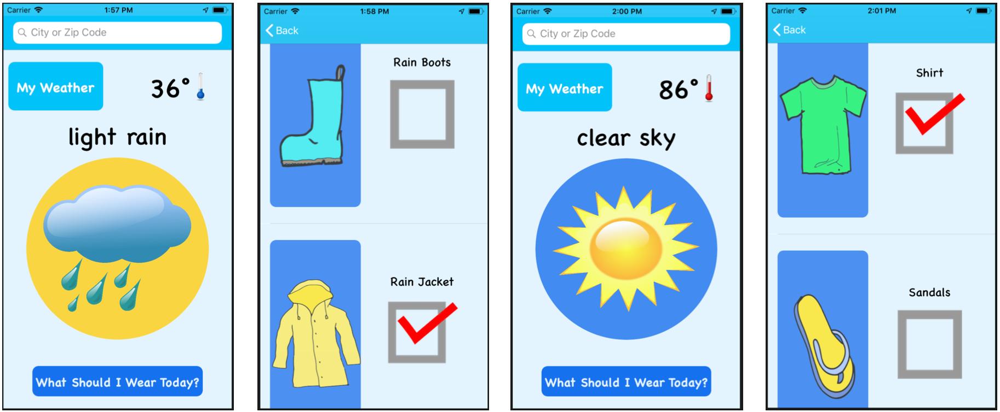

# Weather-Dresser-App

## Description:
This simple and intuitve app will help kids decide how to dress for the current weather . Parenst no longer need to worry that their child will forget their hat in the winter or an umbrella when it's raining!  This app will help teach them what clothing items they need for weather conditions and provide them with an interactive checklist to make sure they are ready for the day.

Features:
- Current weather data provided by Open Weather Map
- Weather images and descriptions to match current weather
- Ability to search by city or use current location
- Location services optional
- Interactive list of appropriate clothing items for current weather conditions
- Intuitive layout and images for children of all reading levels

## Sample Images: 


## Testing Information:
This app queries data from Open Wearther Map using an API key. These keys are free and anyone can request one, but for general security purposes my API key has not been included in the uploaded code.  To test the full functionality of this app the perform the following steps:
- Get a free API key from [Open Weather API](https://openweathermap.org/appid)
- Download the WeatherDresser project files
- Create a Constants.swift file within the project
- Within that file put the following code: 
```swift
struct Constants {
    static let apiKey = "INSERT YOUR API KEY HERE"
}
```
- Run the app in the simulator or on your device

## Sources:
### General Sources:
- https://stackoverflow.com/questions/26207846/pass-data-through-segue
- https://developer.apple.com/library/archive/documentation/UserExperience/Conceptual/AutolayoutPG/LayoutUsingStackViews.html
- https://www.raywenderlich.com/508-uistackview-tutorial-introducing-stack-views
- https://medium.com/@abhimuralidharan/asking-customers-for-ratings-and-reviews-from-inside-the-app-in-ios-d85f256dd4ef
- https://stackoverflow.com/questions/8221787/perform-segue-on-viewdidload
- https://stackoverflow.com/questions/35234204/change-a-xcode-view-after-a-certain-time
- https://stackoverflow.com/questions/1878595/how-to-make-a-circular-uiview/16584298
- https://www.hackingwithswift.com/example-code/system/how-to-save-user-settings-using-userdefaults
- https://stackoverflow.com/questions/25296691/get-users-current-location-coordinates
- https://developer.apple.com/documentation/uikit/uialertcontroller
- https://stackoverflow.com/questions/25296691/get-users-current-location-coordinates
- https://stackoverflow.com/questions/7447248/reset-text-in-textfield-of-uisearchbar-when-x-button-is-clicked-but-not-resign
- https://developer.apple.com/documentation/uikit/uialertcontroller
- https://stackoverflow.com/questions/38340493/emoji-in-ios-app-alerts-and-notifications-xcode-swift
- https://stackoverflow.com/questions/26207846/pass-data-through-segue
- https://stackoverflow.com/questions/24070450/how-to-get-the-current-time-as-datetime
- https://www.hackingwithswift.com/example-code/strings/replacing-text-in-a-string-using-replacingoccurrencesof
- https://stackoverflow.com/questions/27371194/set-action-listener-programmatically-in-swift
- https://stackoverflow.com/questions/28894765/uibutton-action-in-table-view-cell
- https://blog.usejournal.com/custom-uiview-in-swift-done-right-ddfe2c3080a
- https://stackoverflow.com/questions/21850436/add-a-uiview-above-all-even-the-navigation-bar
- https://stackoverflow.com/questions/25965239/how-do-i-get-the-app-version-and-build-number-using-swift
-  https://stackoverflow.com/questions/25524638/disable-a-button
-  https://github.com/codepath/ios_guides/wiki/Animating-A-Sequence-of-Images
- https://www.raywenderlich.com/363-ios-animation-tutorial-getting-started
- https://stackoverflow.com/questions/28760541/programmatically-go-back-to-previous-viewcontroller-in-swift
- https://stackoverflow.com/questions/44662936/view-changes-size-depending-on-device-screen-size-but-should-have-a-fixed-size
- https://stackoverflow.com/questions/26132658/pop-2-view-controllers-in-nav-controller-in-swift
### App Icon Source:
- https://www.mycutegraphics.com/graphics/school/classroom/classroom-weather-job.html
### Photo Sources:
- https://openclipart.org/detail/18414/weather-symbols
- https://openclipart.org/collection/collection-detail/gnokii/6536
- https://openclipart.org/detail/221702/clothing-assortment
- https://openclipart.org/detail/103813/umbrella
- https://openclipart.org/detail/192065/jacket
- https://openclipart.org/detail/191039/yes-mark
- https://www.vectorstock.com/royalty-free-vector/running-athletic-man-in-tracksuit-animation-frame-vector-12178947
- https://openclipart.org/detail/297695/high-top-shoes

